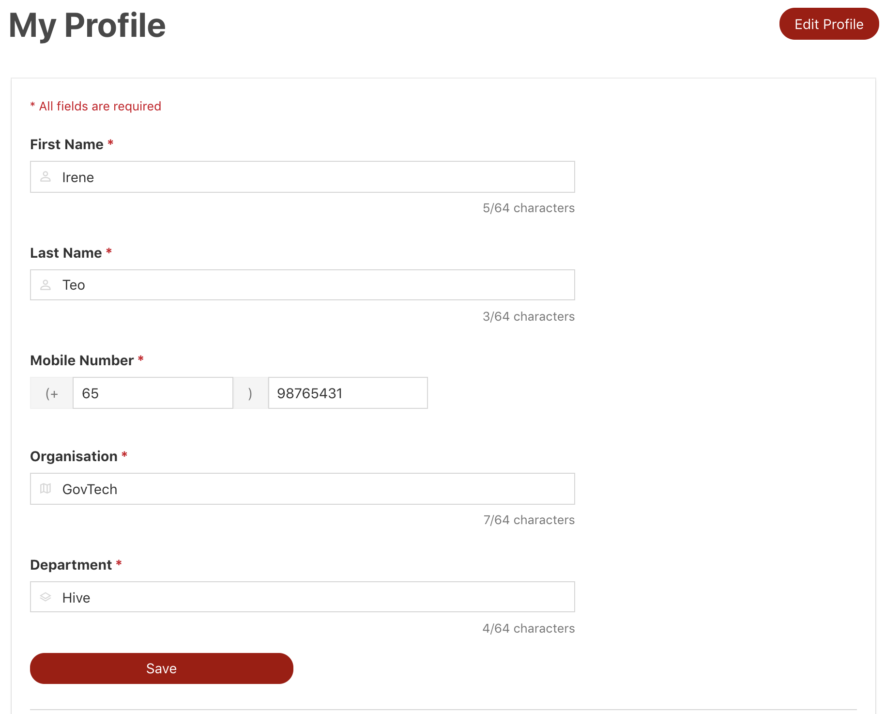
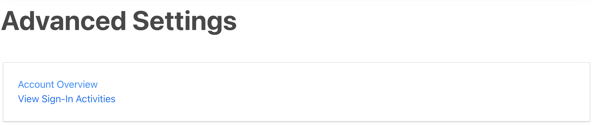
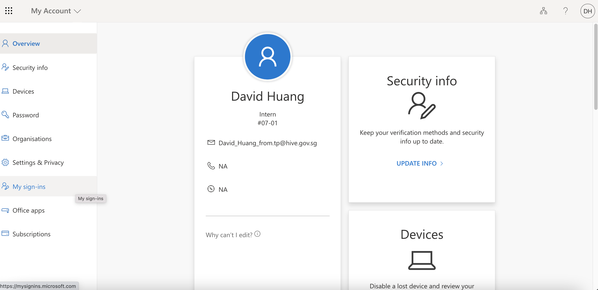
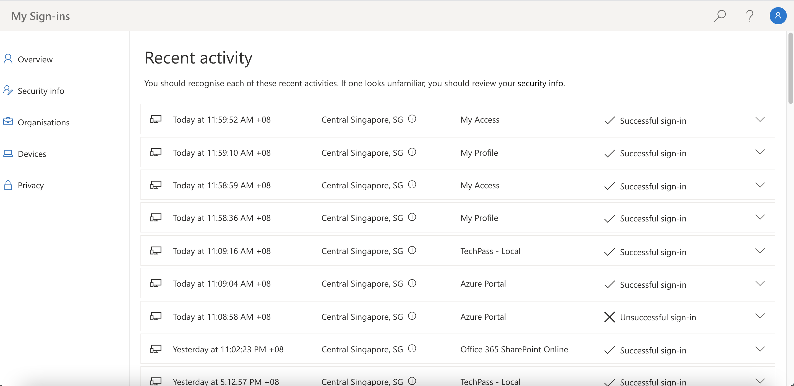
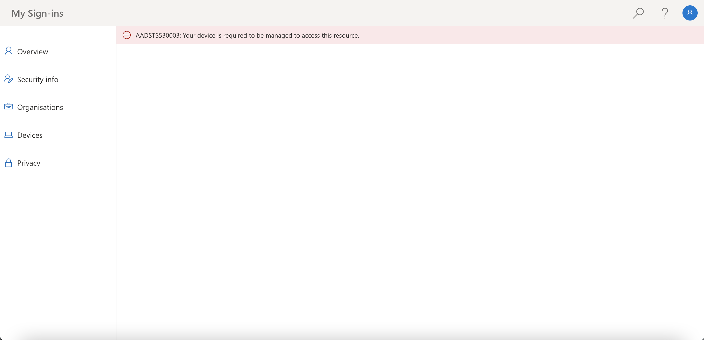
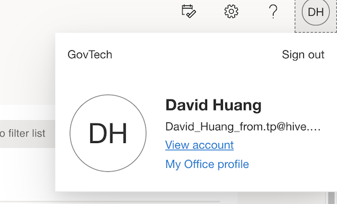

# Account
Account contains your profile and other user settings.

## Profile
Updating your profile enables TechPass and SGTS products to quickly reach out to you when encountering any difficulties.

!> Updating your TechPass profile does not automatically update your WoG profile. Please approach WoG or your HR directly to get your profile updated.

!> If you are a verified vendor/contractor, please raise a ticket to update your profile [here](https://go.gov.sg/techpass-sr).

## Advanced Settings
This section contains links to view your account and sign-in logs via Microsoft myaccount.

Upon clicking **Account Overview**, you should see a page as shown below, with your account details.

Upon clicking **View Sign-In Activities**, you should see a page with all of your sign-in activity logs, as shown below.

!> If you face this error while trying to view your sign-in activity logs as shown below, please do the following steps as a workaround to view them.

### Steps to workaround sign-in activity error

1. Visit [office.com](https://office.com)
2. Click on **View Account**

	

3. You should be able to see your account overview page.

	

4. Click on **My sign-ins** on the left. You should now be able to see your sign-in activity logs.