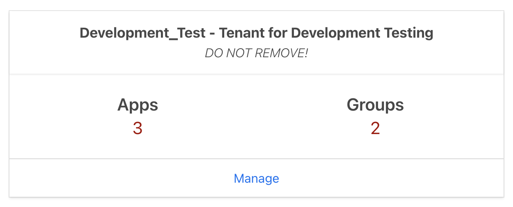
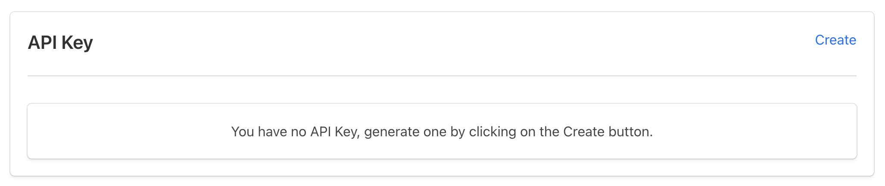
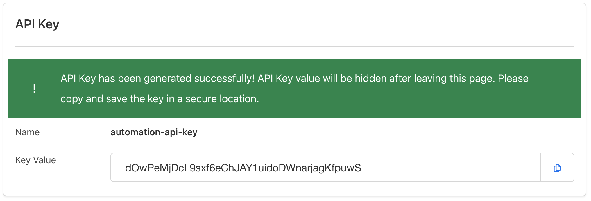

1. Login to the TechPass Portal and ensure you are a **Tenant Admin** for your Tenant.
2. Navigate to your Tenant in the dashboard by clicking **Manage**.

3. While on the **Overview** tab, scroll down until you see the API Key section.

4. Click Create and take note of the API Key value because **this is the only time the full value will be shown**.

5. Ensure that the API Key is stored securely, **DO NOT SHARE THE API KEY** and **DO NOT COMMIT THE API KEY TO THE SOURCE CODE REPO**.