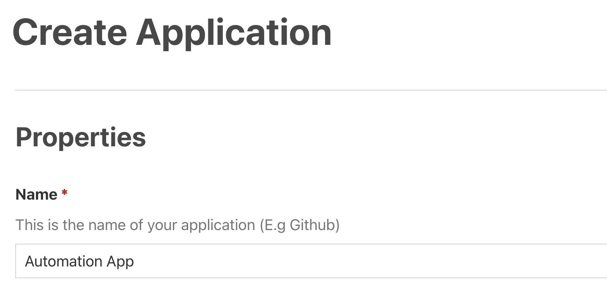
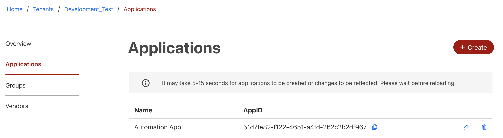

1. Go to the Applications tab and Create an Application to represent your Automation App.

2. Wait for a few seconds for the Automation App to be fully created. Refresh the list once in a while to see if your Automation App has been successfully created.

3. Copy the Application ID (also known as the Client ID).