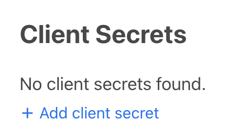
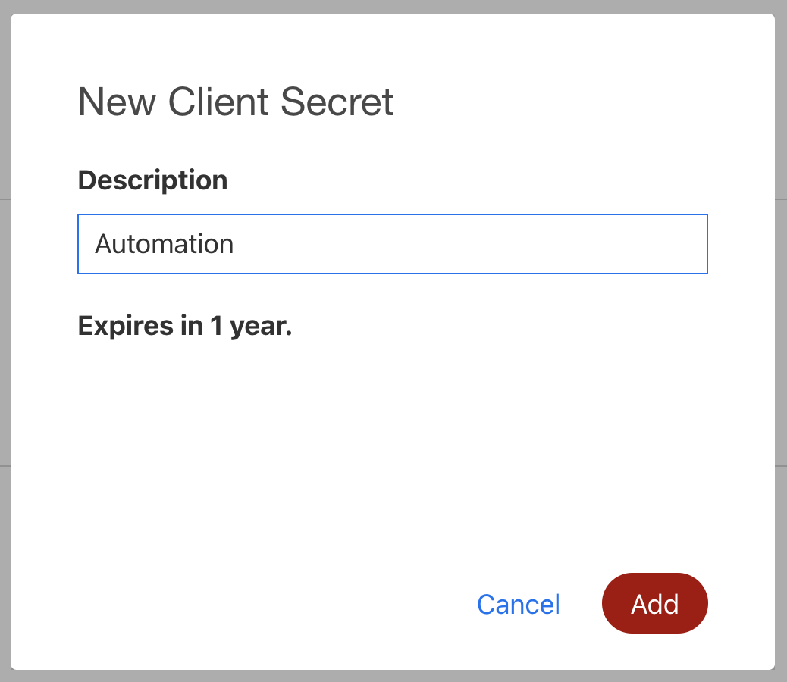
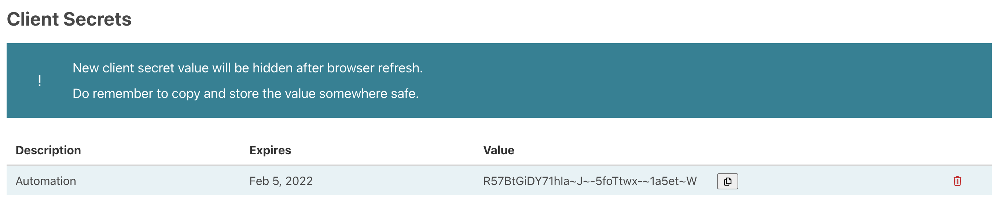

1. Click the **Edit** button to edit the Automation App.
2. Scroll down to the **Client Secrets** section.

3. Click on the **+ Add client secret** and provide a description, then click on **Add**.

4. Take note of this client secret because **this is the only time the full value will be shown**.

5. Ensure that the client secret is stored securely, **DO NOT SHARE THE CLIENT SECRET** and **DO NOT COMMIT THE CLIENT SECRET TO THE SOURCE CODE REPO**.