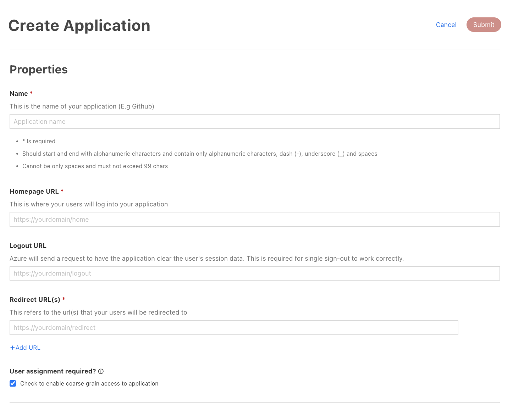
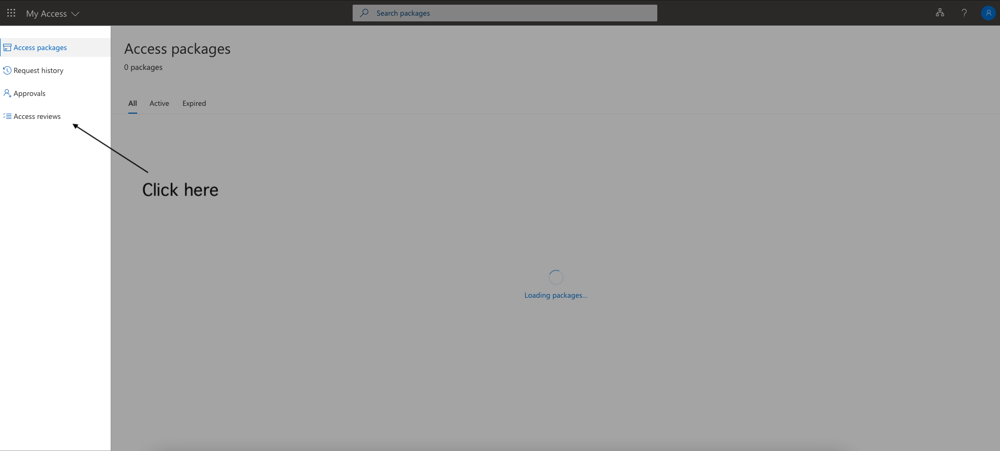
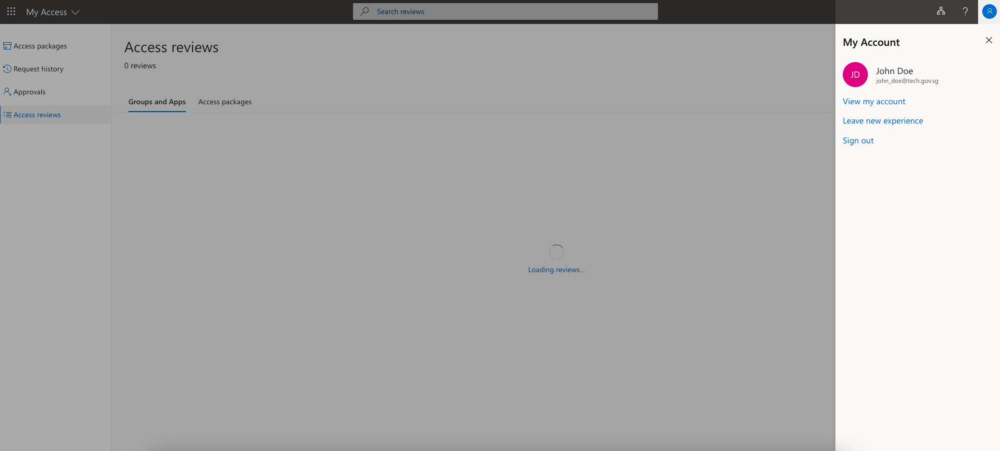
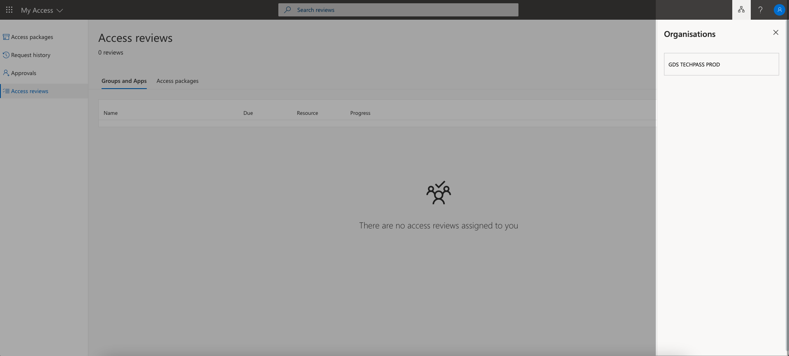

# Client Applications

## Overview
Client applications or application (or simply apps) are namespace objects that represent a single tenant service that is integrated with TechPass AAD. Apps describes the tenant service to TechPass AAD and contains properties that define how TechPass AAD should interact with them. 

## Properties
?> Some of these properties will only appear after the Client App has been created.

### Application ID
The ID of the App. This is used to identify your tenant service to TechPass AAD during a HTTP request.

### Directory ID
The directory ID of TechPass AAD tenant with Microsoft's Azure AD SaaS. This allows the authentication endpoints to identify that the requests should be directed to TechPass AAD.

### Common Endpoints
This drawer popup contains the URLs for needed for using the Auth Code grant and Implicit Grant flows. Remember to replace the values in square brackets.

### Owners
A list of users that are has the permission to make changes to the Client App properties, which should typically be the administrators of the Tenant Namespace.

### Name*
An unique app name to identify your service on TechPass.

### Homepage URL
The landing page of your application where your users will use to login.

### Logout URL
You can specify a URL to redirect your users to after they have successfully logged out from your app.

### Redirect URL*
After successfully authenticating your users, you will want your users to be redirected by to your app. You will need to provide 1 or more valid URLs to redirect your user to. This should be a user routable URL.

TechPass AAD will validate the `redirect_uri` parameter in all authorize HTTP requests for the app. If the value of the parameter does not match any of the URLs in this list. The authorisation request will fail.

- To add more URLs, click on '*+ Add URL*' and enter the URL in the new text field that appears. 
- To remove an existing URL, just click on the thrash bin on the right of the URL that you want to remove.
- Remember to click the Update button at the top if you are editing the URLs for an existing app.

?> More information on Redirect URLs, can be found [here](https://docs.microsoft.com/en-us/azure/active-directory/develop/reply-url).

### Enable Sign In
Unchecking this field will disable ALL user sign in to the tenant service.

### User Assignment Required
This properties determines if a user needs to be granted access before he/she is allowed to sign into your app. Leaving this field uncheck means that **ALL** TechPass users will be able to sign into your app.

Careful consideration is required if you wish the alter the value of this field. Find out more about to how design your [Access Model](resources#concepts) with TechPass.

Unchecking user assignment would make your application accessible to anyone with a TechPass account.

!> If a user's access is **explicitly revoked** from other applications; That user will still **have access** to your application, until it expires due to inactivity.

If you left this field checked, you will need to grant access to users that you want to allow into your app. See [Assigning Access to your App](#assigning-access-to-your-app) for more info.

### Implicit Grant
Implicit grant is less secure than other grant flows and disabled by default. 

To enable implicit grant, check the corresponding boxes to allow an Access Token or ID Token or both to be issued in an implicit grant flow.

!> If you do not use implicit grant, please keep the boxes unchecked.

?> More information regarding Implicit Grant is available [here](https://docs.microsoft.com/en-us/azure/active-directory/develop/v2-oauth2-implicit-grant-flow).

### Client Secrets
The secret key is used by tenant services to authenticate itself to TechPass AAD. Each secret key is only valid for a period of one year once created. 

### Assigned Users and Groups
A list of users and/or user groups that has been granted permission to sign in to your tenant service. If you add a user group, ALL users within that group will be granted permission. 

## Registering an App
1. On the applications tab within a namespace, click on the '***+ Create***' button.
2. Fill up the required information marked with '*' and click ***Submit***.

## Deleting a Registered App
!> Deleting an app is a **irreversible** change. Please consider carefully!

1. Click on the '*dustbin*' icon to the right of the app.
2. Click on ***Confirm***.

## Managing Access to your App
?> If you did not disable [User Assignment Required](#user-assignment-required) option, TechPass users will not be able to sign in to your app unless they are authorized (or assigned). 

### Adding a User or Group
1. In the *Assigned Users and Groups* section, click on ***+ Add Users or Groups***.
2. In the *Assign Role* screen, click on '+' sign next to ***Users and Groups***.
3. Key in the a search phrase to locate the user or group.
4. Click on the '+' sign on the right of the user/group. It should then appear on the *Selected Groups / Users* list.
5. Click on ***Submit*** to effect the change. 

### Removing a User or Group 
1. Check the box next to the user/group in the *Assigned Users and Groups* section.
2. Click on ***x Remove Selected.***
3. Click on ***Submit*** to effect the change.

## Reviewing Access to your App

Every quarter, starting from your application creation date, all Tenant Administrators will receive an email asking to review users' access to your application.

The purpose of this review is to ensure that you as a Tenant Administrator make sure only the right people have continued access to your application.

### Steps to review your App

1. You will receive an email asking you to review access. An example of an email is as follow:

2. Click on 'Start Review' link or go to [https://myaccess.microsoft.com/](https://myaccess.microsoft.com/)

3. Select Access reviews from the menu on the left side bar to see a list of pending access reviews assigned to you.

4. Click on the name of an access review to get started.

5. You can select any of the decisions for a user and you can change the decision anytime before the review's end date

| Types of decision | Description|
| ------------- |-------------|
| Approve    | User will continue to have access to your application.|
| Deny      | User will not have access to your application once the decision is applied at the end of the review.|
| Don't Know (Not recommended) | If you are unsure, you can select this option. User gets to keep their access.|
| Accept Recommendation | You can choose to accept Microsoft's Recommendation. The recommendations are generated based on the user's sign-in activity.|

?> Do note that the decisions/remarks you made can be seen by other reviewers and will be recorded in the audit logs. If there are multiple reviewers, the last submitted decision will be the applied result.

### Frequently Asked Questions

#### Q: Why is my page showing "There are no access reviews assigned to you"?

A: Verify the following:

1. Ensure that the review has not ended and you are still a Tenant Administrator.

2. Ensure that you have logged in using the correct email. It should be the email used to sign up TechPass Portal.

3. Ensure that you are in the right organisation.

If you are unable to view the access review after these steps, you may contact us [here.](https://go.gov.sg/techpass-feedback)

#### Q: How long will the review last?

A: The review will last for 14 days and reoccur every quarter till your application is deleted.

#### Q: Can I change the frequency of the review?

A: Currently, you cannot change the frequency of the review. If you have any concerns, you may contact us [here.](https://go.gov.sg/techpass-feedback)

#### Q: When will the results of the review apply to my application?

A: The results will be applied when the review ends. The end date is stated in the email.

#### Q: What will happen if I ignore the review?

A: Reminders will be sent half-way through the duration of the review if you have not completed your review. At the end of the review, if no reviewer has state any action, no change will be taken. We strongly recommend you to always review your users' access.

#### Q: Why are some of the users not included in the review?

A: When you assign user to your application after the review start date, the user will not be reflected in the review.

#### Q: Why am I not included as the reviewer when I am a Tenant Administrator?

A: If you add a new user as a Tenant Administrator after the review start date, he/she will not be included in the current review. The user will only be included as a reviewer in future reviews.
