# Auth Code Flow with Proof Key for Code Exchange (PKCE)
This guide will provide the streamlined instructions to application setup and enabling features to support the OAuth 2.0's Auth Code Flow with Proof Key for Code Exchange (PKCE): https://docs.microsoft.com/en-us/azure/active-directory/develop/v2-oauth2-auth-code-flow

### Objectives
* integrate with TechPass, so that your users can sign into your application (usually a web application with browser) with a TechPass account
* using TechPass to **authenticate** the user, establish a session and using the return ID & Access token to **authorise** your users with the right permissions to access your application.

### Pre-requisites
* is a Tenant Admin of a TechPass Tenant
* have a basic understanding of OAuth 2.0's Auth Code Flow with Proof Key for Code Exchange (PKCE), see: [Identity Provider and OAuth2 in TechPass](oauth2)
* your application portal design have a Frontend and Backend infrastructure setup

## [1] Create an application
Assuming you are already familiar with OAuth 2.0's Auth Code Flow with Proof Key for Code Exchange (PKCE); An application in TechPass what you will use to manage the configurations required by your portal to establish the various OAuth grant flows, coarse and fine grant control of your users, groups and service roles*.

*service roles is a work in progress feature. It's currently not supported in TechPass [19 Feb 2021]

Managing of applications is only possible if you are a tenant admin of your tenant.

So please switch your role to **TENANT** after your sign into TechPass. (Refer [here](/docs/roles.md) on how to switch role)

Next, select the tenant you like to create the application, then click on Applications on the navigation side bar

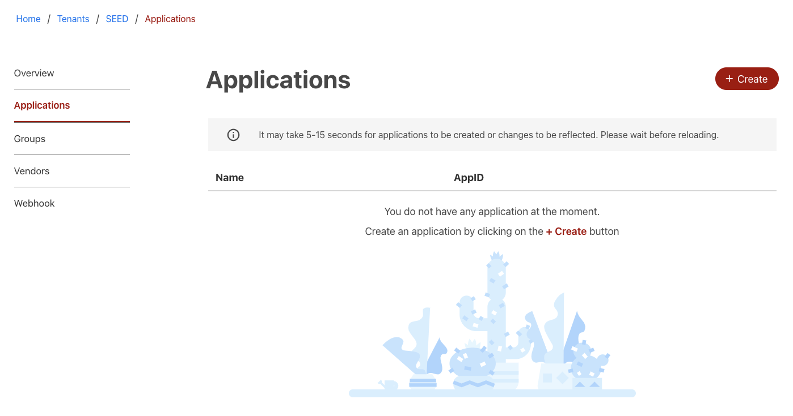

Click + Create button and fill in the following properties

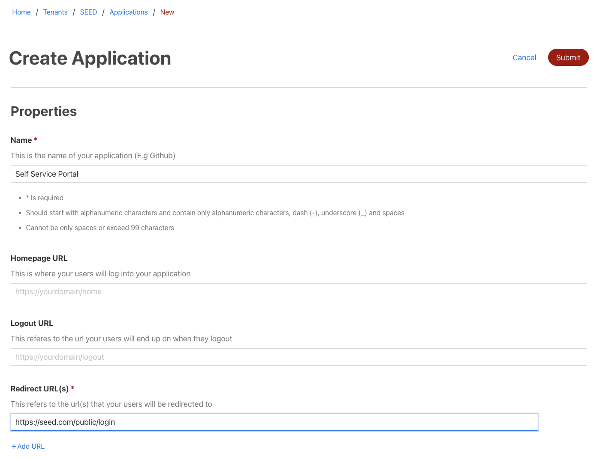

| Property | Description | Required? |
| --- | --- | --- |
| Homepage URL | your portal homepage. Enter this value if you like your homepage url be available for users access via TechPass dashboard | no |
| Redirect URL(s) | this is frontend landing page used to receive the code from Microsoft via TechPass AAD after user authentication. The one time usage code needs to be send to your backend for the next step in Auth Code grant flow. You may specify more redirect urls if you like to use the same application to manage the Single Sign On flow for different portals. | yes |
| Logout URL | Specifies the URL that will be used by Microsoft's authorization service to logout an user using front-channel, back-channel or SAML logout protocols. reference: https://docs.microsoft.com/en-us/graph/api/resources/webapplication?view=graph-rest-beta Microsoft will attempt to redirect to this url after it has completed the sign out request when you trigger a logout request to Microsoft via TechPass AAD. **Note: [technical limitation]** You **cannot** specify a localhost (eg. 127.0.0.1) url here for your local development environment. | no |
| Name | name of the application for your portal SSO setup | yes |

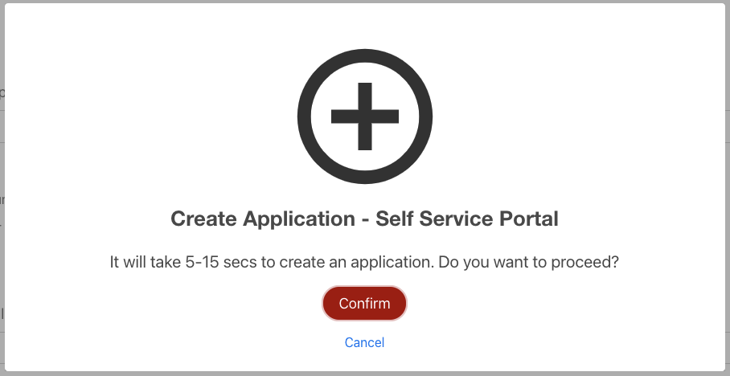

Click Submit and Confirm to proceed the creation of the application. It may take some time for the application to be created. Reload the page via browser refresh if you don't see the application record as displayed below.

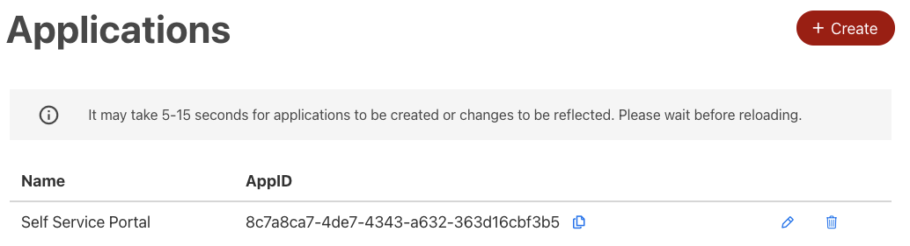

## [2] Create secret
Click on the pencil icon next to the application you wish to edit.


Scroll down to Client Secrets and click on + Add client secret

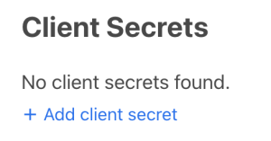

Enter a name for this secret. Please note that the validity period for this secret is 1 year. You should plan for secrets rollover.

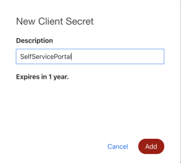

Make sure you copy and securely store the generated secret. use some key vaults or AWS Secret manager

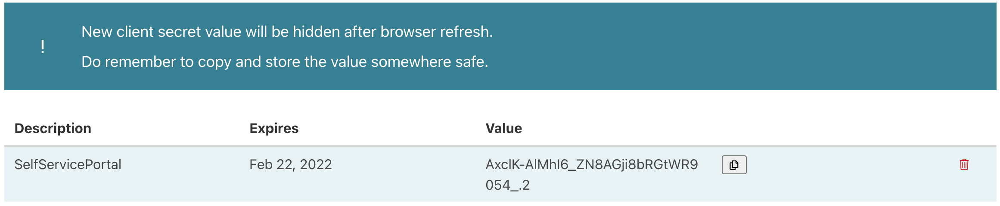

Note: Secret will be hidden the next time you return to this page.

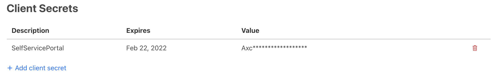

## [3] Gather the endpoints and configurations required for your portal
You should see Application ID and Directory ID from the properties section of your application. Please make a note of these values.


Next, click Common Endpoints button to open up a panel of endpoints. Scroll down to Authorization Code Flow and copy Login and Token Request URLs

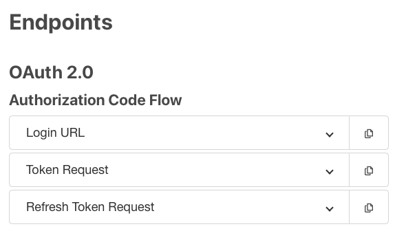
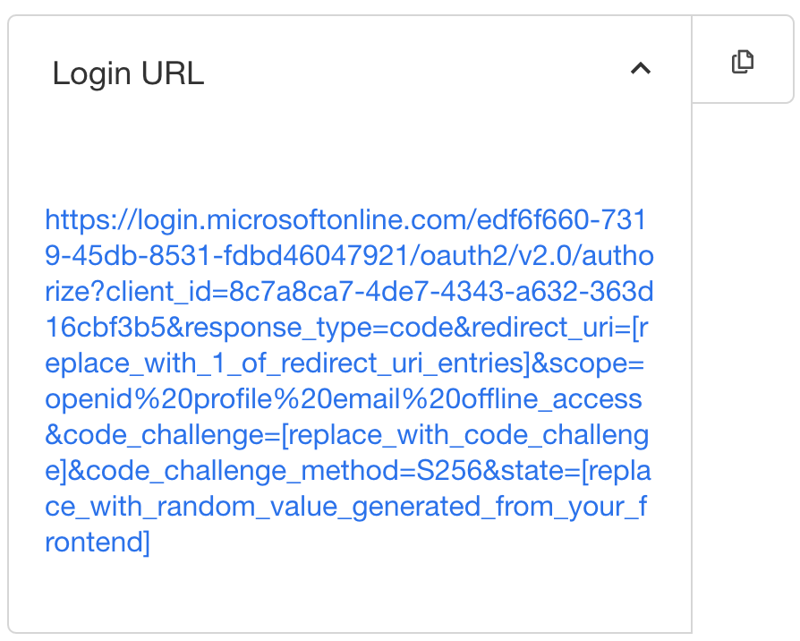

https://login.microsoftonline.com/edf6f660-7319-45db-8531-fdbd46047921/oauth2/v2.0/authorize?client_id=8c7a8ca7-4de7-4343-a632-363d16cbf3b5&response_type=code&redirect_uri=[replace_with_1_of_redirect_uri_entries]&scope=openid%20profile%20email%20offline_access&code_challenge=[replace_with_code_challenge]&code_challenge_method=S256&state=[replace_with_random_value_generated_from_your_frontend]

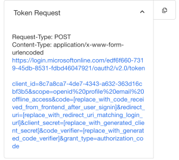

Request-Type: POST<br>Content-Type: application/x-www-form-urlencoded
https://login.microsoftonline.com/edf6f660-7319-45db-8531-fdbd46047921/oauth2/v2.0/token

client_id=8c7a8ca7-4de7-4343-a632-363d16cbf3b5&scope=openid%20profile%20email%20offline_access&code=[replace_with_code_received_from_frontend_after_user_signin]&redirect_uri=[replace_with_redirect_uri_matching_login_url]&client_secret=[replace_with_generated_client_secret]&code_verifier=[replace_with_generated_code_verifier]&grant_type=authorization_code

## [4] Create a method that generates the login URL (Frontend)
Create a method in your frontend that will generate the login url using the following template you've copied from Common Endpoints:

https://login.microsoftonline.com/edf6f660-7319-45db-8531-fdbd46047921/oauth2/v2.0/authorize?client_id=8c7a8ca7-4de7-4343-a632-363d16cbf3b5&response_type=code&redirect_uri=[replace_with_1_of_redirect_uri_entries]&scope=openid%20profile%20email%20offline_access&code_challenge=[replace_with_code_challenge]&code_challenge_method=S256&state=[replace_with_random_value_generated_from_your_frontend]

1. Check that the directory id and client id matches the values found in the properties of your application
2. Replace [replace_with_1_of_redirect_uri_entries] with 1 of the redirect url entered during application creation. value needs to be URL encoded
3. Generate random value for state.
   
    **state** is a value included in the request that will also be returned in the token response. It can be a string of any content that you wish. A randomly generated unique value is typically used for preventing cross-site request forgery attacks. The value can also encode information about the user's state in the app before the authentication request occurred, such as the page or view they were on. reference: https://docs.microsoft.com/en-us/azure/active-directory/develop/v2-oauth2-auth-code-flow

    It can be any string but you can consider using uuid version 4 generators, then you will need to store this value in memory (state/local session storage) and replace [replace_with_random_value_generated_from_your_frontend] with this value. 

    **Note:** state is a one time use value, you are going to need to generate a new random state for every login (/authorize) call to microsoft
4. Generate code challenge

    Code challenge is used to secure authorization code grants via Proof Key for Code Exchange (PKCE). For more information, see the PKCE RFC. This is now recommended for all application types - native apps, SPAs, and confidential clients like web apps. reference: https://docs.microsoft.com/en-us/azure/active-directory/develop/v2-oauth2-auth-code-flow

    A code verifier is a random string between 43 and 128 characters long that consists of the characters A-Z, a-z, 0-9, and the punctuation -._~ (hyphen, period, underscore, and tilde).

    The “code challenge” is created by performing a SHA256 hash on the code verifier and then Base64url encoding the hash e.g.

    ```code_challenge = BASE64URL-ENCODE(SHA256(ASCII(code_verifier)))```

    Then replace [replace_with_code_challenge] with the generate code challenge
   

Download TechPass logo: [techpass.svg](assets/techpass.svg)
```
<a id="techpass-logo" href="[method that generates the login url]"><button class="sgds-button is-primary ">Login with TechPass</button></a>
```

You can test the generated login url directly on a browser. Chrome is recommended.

The response will be redirected to the frontend page you've specified in redirect_uri. The page is responsible to catch and process the following successful and error response.

### Successful response
A successful response using response_mode=query looks like:

HTTP

GET https://login.microsoftonline.com/common/oauth2/nativeclient? code=AwABAAAAvPM1KaPlrEqdFSBzjqfTGBCmLdgfSTLEMPGYuNHSUYBrq... &state=12345

SUCCESSFUL RESPONSE

| Parameter | Description |
| --- | --- |
| code | The authorization_code that the app requested. The app can use the authorization code to request an access token for the target resource. Authorization_codes are short lived, typically they expire after about 10 minutes.|
| state | 	If a state parameter is included in the request, the same value should appear in the response. The app should verify that the state values in the request and response are identical. |
**Note:** You must **not** proceed with token request if state returned doesn't match the copy you've stored in memory.

### Error response
Error responses may also be sent to the redirect_uri so the app can handle them appropriately:

HTTP

GET https://login.microsoftonline.com/common/oauth2/nativeclient? error=access_denied &error_description=the+user+canceled+the+authentication

ERROR RESPONSE

| Parameter | Description |
| --- | --- |
| error | An error code string that can be used to classify types of errors that occur, and can be used to react to errors. |
| error_description | A specific error message that can help a developer identify the root cause of an authentication error. |
Refer to https://docs.microsoft.com/en-us/azure/active-directory/develop/v2-oauth2-auth-code-flow#error-codes-for-authorization-endpoint-errors for other possible errors.

## [5] Request for token (Backend)
Next, send the returned code, code verifier, client ID and redirect url to your backend for token request if the response is successful and the state is a matched.

Make the following call to request for id, access and refresh tokens from Microsoft. Replace the respective parameters with the data passed from frontend and [replace_with_generated_client_secret] with the secret you've generated earlier and [replace_with_generated_code_verifier] with the code verifier generated in step 3.

Request-Type: POST

Content-Type: application/x-www-form-urlencoded

https://login.microsoftonline.com/edf6f660-7319-45db-8531-fdbd46047921/oauth2/v2.0/token

client_id=8c7a8ca7-4de7-4343-a632-363d16cbf3b5

&code=[replace_with_code_received_from_frontend_after_user_signin]

&redirect_uri=[replace_with_redirect_uri_matching_login_url]

&client_secret=[replace_with_generated_client_secret]

&code_verifier=[replace_with_generated_code_verifier]

&grant_type=authorization_code

### Successful response
A successful token response will look like:

JSON
```
{
"access_token": "eyJ0eXAiOiJKV1QiLCJhbGciOiJSUzI1NiIsIng1dCI6Ik5HVEZ2ZEstZnl0aEV1Q...",
"token_type": "Bearer",
"expires_in": 3599,
"scope": "https%3A%2F%2Fgraph.microsoft.com%2Fmail.read",
"refresh_token": "AwABAAAAvPM1KaPlrEqdFSBzjqfTGAMxZGUTdM0t4B4...",
"id_token": "eyJ0eXAiOiJKV1QiLCJhbGciOiJub25lIn0.eyJhdWQiOiIyZDRkMTFhMi1mODE0LTQ2YTctOD...",
}
```
SUCCESSFUL RESPONSE

| Parameter | Description |
| --- | --- |
| access_token | The requested access token. The app can use this token to authenticate to the secured resource, such as a web API. |
| token_type | Indicates the token type value. The only type that Azure AD supports is Bearer |
| expires_in | How long the access token is valid (in seconds). |
| scope | The scopes that the access_token is valid for. Optional - this is non-standard, and if omitted the token will be for the scopes requested on the initial leg of the flow. |
| refresh_token | An OAuth 2.0 refresh token. The app can use this token acquire additional access tokens after the current access token expires. Refresh_tokens are long-lived, and can be used to retain access to resources for extended periods of time. For more detail on refreshing an access token, refer to the section below. **Note:** Only provided if offline_access scope was requested. |
| id_token | A JSON Web Token (JWT). The app can decode the segments of this token to request information about the user who signed in. The app can cache the values and display them, and confidential clients can use this for authorization. For more information about id_tokens, see the id_token reference. **Note:** Only provided if openid scope was requested. |

### Error response
Error responses will look like:

JSON
```
{
"error": "invalid_scope",
"error_description": "AADSTS70011: The provided value for the input parameter 'scope' is not valid. The scope https://foo.microsoft.com/mail.read is not valid.\r\nTrace ID: 255d1aef-8c98-452f-ac51-23d051240864\r\nCorrelation ID: fb3d2015-bc17-4bb9-bb85-30c5cf1aaaa7\r\nTimestamp: 2016-01-09 02:02:12Z",
"error_codes": [
70011
],
"timestamp": "2016-01-09 02:02:12Z",
"trace_id": "255d1aef-8c98-452f-ac51-23d051240864",
"correlation_id": "fb3d2015-bc17-4bb9-bb85-30c5cf1aaaa7"
}
```
ERROR RESPONSE

| Parameter | Description |
| --- | --- |
| error | An error code string that can be used to classify types of errors that occur, and can be used to react to errors. |
| error_description | A specific error message that can help a developer identify the root cause of an authentication error. |
| error_codes | A list of STS-specific error codes that can help in diagnostics. |
| timestamp | The time at which the error occurred. |
| trace_id | A unique identifier for the request that can help in diagnostics. |
| correlation_id | A unique identifier for the request that can help in diagnostics across components. |
Refer to https://docs.microsoft.com/en-us/azure/active-directory/develop/v2-oauth2-auth-code-flow#error-codes-for-token-endpoint-errors for other possible errors.

**Note:** remember to store the ID(more info), Access(more info) and Refresh json tokens securely in the backend. !!! Never return these tokens to the frontend. It's considered bad practice.

ID token - contains information of the user's identity. Application groups that the user is a member of will be returned via id token as well.

Access token - use this token as Authorization bearer token with TechPass Automation APIs. This is a short live token of (5-15 mins)

Refresh token - use this token to request for access token when the current expires.

Authorization Code Grant flow is considered completed at this point. You may establish a secure session with your user now.

## [6] Verify ID Token's Signature
You can read up more on the different tokens provided by Azure's B2C and on how to validate signature and claims: https://docs.microsoft.com/en-us/azure/active-directory-b2c/tokens-overview#validate-signature

Manual verification of ID token's signature Reference: https://blogs.aaddevsup.xyz/2019/03/using-jwt-io-to-verify-the-signature-of-a-jwt-token/

Here's what you need to do upon receiving the ID token in your backend

1. Parse ID JWT token and make note of kid value. The algorithm in used is RS256
   ```
   {
      "typ": "JWT",
      "alg": "RS256",
      "kid": "GvnPApfWMdLRi8PDmisFn7bprKg"
   }
   ```
2. Make a GET call to https://login.microsoftonline.com/{directory id}/discovery/v2.0/keys. Replace {directory id} with the directory id obtained in step 3, gathering of endpoints and configurations.
3. Parse the results returned from /keys endpoint and find the record matching kid value. Extract the x5c value then enclose the string  in the BEGIN CERTIFICATE / END CERTIFICATE block as followed. That will form the public key used to verify the signature.  
   **Construct the Public Certificate (Golang)**
   ```golang
   // forming public key string
   func (p *Parser) getCert(data map[string]interface{}) string {
      x5c, ok := data["x5c"]
      if !ok {
         return ""
      }

      d, ok := x5c.([]interface{})
      if !ok {
         return ""
      }
   
      s := "-----BEGIN CERTIFICATE-----\n"
      s += strings.Join(chunkString(d[0].(string), 64), "\n")
      s += "\n-----END CERTIFICATE-----\n"
      return s
   }
   ```
4. Verify the token signature by retrieving the claims or just parsing the token.
   keyFunc is the callback function that returns the RSA Public Key given the key id and algorithm used in the JWT token.  
   **Note:**  
      a. if a claims object is passed in, it will map the token claims to the jwtGo.Claims object   
      b. the token signature is considered valid when the jwtGo.ParseWithClaims or jwtGo.Parse calls don't return an error
   ```
   // Parse will parse the JWT and return the token form.
   func (p *Parser) Parse(ctx context.Context, jwtToken string, claims jwtGo.Claims) (*jwtGo.Token, error) {
      span, childCtx := tracing.SpanFromContext(ctx, serviceName, "parse", tracing.MergedTags(tracingTags, session.Tags(ctx)))
      defer span.Finish()

      keyFunc := func(token *jwtGo.Token) (interface{}, error) {
        jwkPub, err := p.getCachedJWK(childCtx, token.Header["kid"].(string), token.Header["alg"].(string))
        if err != nil {
            return nil, err
        }
 
        var rsaPub *rsa.PublicKey
        var data map[string]interface{}
 
        b, _ := jwkPub.MarshalJSON()
        err = json.Unmarshal(b, &data)
        if err != nil {
            return nil, err
        }
 
        certStr := p.getCert(data)
        if certStr != "" {
            rsaPub, err = jwtGo.ParseRSAPublicKeyFromPEM([]byte(certStr))
        } else {
            rsaPub, err = jwk.ToRSAPublic(jwkPub)
        }
 
        if err != nil {
            return nil, err
        }
 
        return rsaPub, nil
      }
 
      var token *jwtGo.Token
      var err error
      if claims != nil {
        token, err = jwtGo.ParseWithClaims(jwtToken, claims, keyFunc)
      } else {
        token, err = jwtGo.Parse(jwtToken, keyFunc)
      }
 
      if err != nil {
        return token, err
      }
      return token, nil
   }
   ```

### Caveats
* There's a known azure bug. This method works to verify ID token only. Verifying the access token always returns an error. It could be a key id and public certificate mismatch. (Update: there's a potential solution for this: https://github.com/AzureAD/azure-activedirectory-identitymodel-extensions-for-dotnet/issues/609. We will try it out and update later)
* There's also a mismatch for the "aud" value in the tokens. We will update again once we have a solution on this. It would be great to be able to validate the appropriate target audience value.

Alternative you may use a library for verifying ID token's signature, if available. Please note that at least they follow the above procedure.
Here's one for nodejs: https://github.com/99x/azure-jwt-verify

## Refresh Tokens
Copy refresh token api call from common endpoints. Refer to the following guide on the parameters you need to pass in.

https://docs.microsoft.com/en-us/azure/active-directory/develop/v2-oauth2-auth-code-flow#refresh-the-access-token
