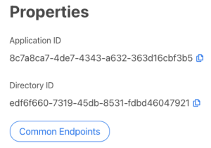
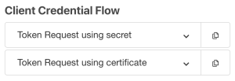
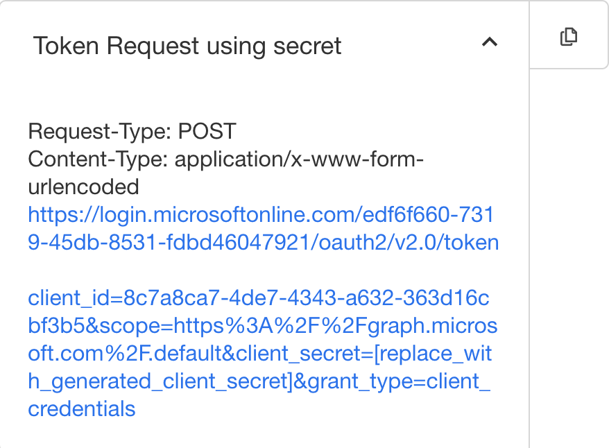
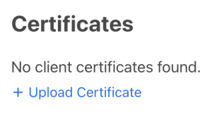
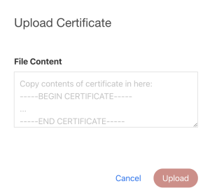
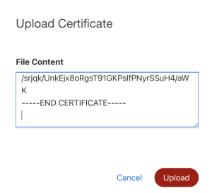
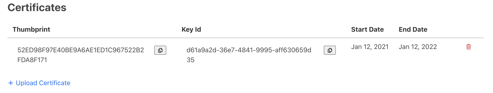
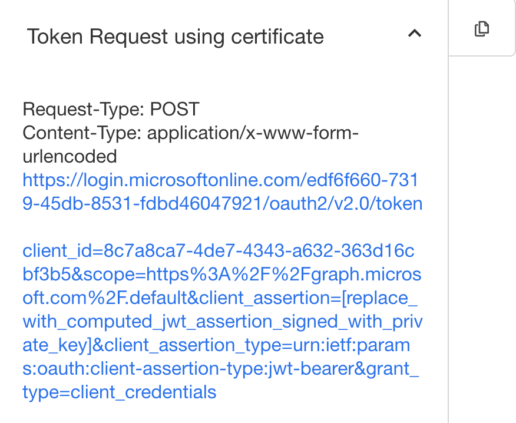

# Client Credentials Grant Flow
This guide will provide the streamlined instructions to application setup and enabling features to support the 
OAuth 2.0's Client Credentials Grant: https://docs.microsoft.com/en-us/azure/active-directory/develop/v2-oauth2-client-creds-grant-flow

### Objectives
* establishing a connection with TechPass from your backend. System to System.
* using TechPass to **authenticate** the system with secrets or certificate then returning Access token to access TechPass Automation APIs

### Pre-requisites
* is a Tenant Admin of a TechPass Tenant
* have a basic understanding of OAuth 2.0's Client Credentials Grant, see: [Identity Provider and OAuth2 in TechPass](oauth2)
* your application portal design have a Frontend and Backend infrastructure setup. Although only backend can use this flow.

## Create an application
Refer to create an application step in [Auth Code](authcodegrant) flow if you haven't created an application.

## Establish client credentials grant flow with secret
### Create Secret
Refer to create secret step in [Auth Code](authcodegrant) flow if you haven't created a secret yet.

### Gather the endpoints and configurations required for your portal
You should see Application ID and Directory ID from the properties section of your application. Please make a note of these values.



Next, click Common Endpoints button to open up a panel of endpoints. Scroll down to Client Credential Flow and copy Token Request using secret URL




Request-Type: POST  
Content-Type: application/x-www-form-urlencoded

https://login.microsoftonline.com/edf6f660-7319-45db-8531-fdbd46047921/oauth2/v2.0/token

client_id=8c7a8ca7-4de7-4343-a632-363d16cbf3b5  
&scope=https%3A%2F%2Fgraph.microsoft.com%2F.default  
&client_secret=[replace_with_generated_client_secret]  
&grant_type=client_credentials

### Token Request (Backend)
Next, retrieve the client secret generated earlier.

Make the following call to request for access tokens from Microsoft. Replace  [replace_with_generated_client_secret] with the secret.

Request-Type: POST  
Content-Type: application/x-www-form-urlencoded

https://login.microsoftonline.com/edf6f660-7319-45db-8531-fdbd46047921/oauth2/v2.0/token

client_id=8c7a8ca7-4de7-4343-a632-363d16cbf3b5  
&scope=https%3A%2F%2Fgraph.microsoft.com%2F.default  
&client_secret=[replace_with_generated_client_secret]  
&grant_type=client_credentials

```
# Replace {secret} with your secret!
# Replace {tenant} with your Directory ID!
# Replace {clientid} with your Application ID!
 
curl -X POST -H "Content-Type: application/x-www-form-urlencoded" -d 'client_id={clientid}&scope=https%3A%2F%2Fgraph.microsoft.com%2F.default&client_secret={secret}&grant_type=client_credentials' 'https://login.microsoftonline.com/ {tenant}/oauth2/v2.0/token'
```

#### Successful response
A successful response looks like this:

```
JSON
{
    "token_type": "Bearer",
    "expires_in": 3599,
    "access_token": "eyJ0eXAiOiJKV1QiLCJhbGciOiJSUzI1NiIsIng1dCI6Ik1uQ19WWmNBVGZNNXBP..."
}
```

SUCCESSFUL RESPONSE

| Parameter | Description |
| --- | --- |
| access_token	| The requested access token. The app can use this token to authenticate to the secured resource, such as to a web API. |
| token_type	| Indicates the token type value. The only type that the Microsoft identity platform supports is bearer. |
| expires_in	| The amount of time that an access token is valid (in seconds). |

#### Error response
An error response looks like this:

```
JSON
{
    "error": "invalid_scope",
    "error_description": "AADSTS70011: The provided value for the input parameter 'scope' is not valid. The scope https://foo.microsoft.com/.default is not valid.\r\nTrace ID: 255d1aef-8c98-452f-ac51-23d051240864\r\nCorrelation ID: fb3d2015-bc17-4bb9-bb85-30c5cf1aaaa7\r\nTimestamp: 2016-01-09 02:02:12Z",
    "error_codes": [
        70011
    ],
    "timestamp": "2016-01-09 02:02:12Z",
    "trace_id": "255d1aef-8c98-452f-ac51-23d051240864",
    "correlation_id": "fb3d2015-bc17-4bb9-bb85-30c5cf1aaaa7"
}
```

ERROR RESPONSE

| Parameter | Description |
| --- | --- |
| error	            | An error code string that you can use to classify types of errors that occur, and to react to errors. |
| error_description	| A specific error message that might help you identify the root cause of an authentication error. |
| error_codes	    | A list of STS-specific error codes that might help with diagnostics. |
| timestamp	        | The time when the error occurred. |
| trace_id	        | A unique identifier for the request to help with diagnostics. |
| correlation_id	| A unique identifier for the request to help with diagnostics across components. |

**Note:**  
remember to store the Access ([more info](https://docs.microsoft.com/en-us/azure/active-directory/develop/access-tokens)) json tokens securely in the backend. !!! Never return these tokens to the frontend. It's considered bad practice.

Access token - use this token as Authorization bearer token with TechPass Automation APIs. This is a short live token of (5-15 mins). Application Access token will inherit the default permissions assigned to the application. (These permissions are defined by TechPass; You are not permitted to alter this. If you have any special requirements, please contact TechPass)

Client Credentials Grant flow with secret is considered completed at this point.

## Establish client credentials grant flow with certificate
### Pre-requisite
This guide is assuming you've already have a public certificate and private key. Note: Self signed certificate are not permitted.

Obtain a certificate issued by CoreSG (WOG CA - to be confirmed at a later time) or public CA (eg. let's encrypt or AWS certificate manager)
* **Note:** CSG recommends 1 year maximum for validity period. You will need to plan for rollover
* Keep your private key secure. Can consider using AWS Secret Manager but please be mindful of the secrets size limit (more info)

### Upload Certificate
Go to the edit mode of your application and scroll down to Certificates



Click + Upload Certificate. (to update this segment when we support upload by file)

You should see the following pop up dialog.



Open your public certificate in a text editor and copy all the content into File Content textbox.



Click Upload button. You should see a record like this once the certificate is uploaded. Take note of the Thumbprint value. It is needed for the generation of JWT assertion.



### Gather the endpoints and configurations required for your portal
You should see Application ID and Directory ID from the properties section of your application. Please make a note of these values.


Next, click Common Endpoints button to open up a panel of endpoints. Scroll down to Client Credential Flow and copy Token Request using certificate URL




Request-Type: POST  
Content-Type: application/x-www-form-urlencoded

https://login.microsoftonline.com/edf6f660-7319-45db-8531-fdbd46047921/oauth2/v2.0/token

client_id=8c7a8ca7-4de7-4343-a632-363d16cbf3b5  
&scope=https%3A%2F%2Fgraph.microsoft.com%2F.default  
&client_assertion=[replace_with_computed_jwt_assertion_signed_with_private_key]  
&client_assertion_type=urn:ietf:params:oauth:client-assertion-type:jwt-bearer  
&grant_type=client_credentials

### Generate JWT assertion
In order to request for an access token using client credentials flow with certificate, you will need to form a JWT assertion that is signed by the private key that is a match to the public certificate that you've just uploaded. 
This [article](https://docs.microsoft.com/en-us/azure/active-directory/develop/active-directory-certificate-credentials) describes the computation of JWT assertion in detail.

#### Load the private key
Retrieve the matching private key from your secure storage  (Eg. AWS ACM or secret manager.)  
Find out which Public-Key Cryptography Standard is used to generate your private key - public certificate pair.  
then using pem and x509 libraries to load your private key 

**Load RSA Private key - Golang** 
```
func (t Token) LoadPrivateKey(input LoadPrivateKeyInput) (*rsa.PrivateKey, error) {
    var keyData []byte
    var err error
    if input.Mode == FileLoad {
        keyData, err = ioutil.ReadFile(input.FilePath) //eg. "./cert/server.key"
        if err != nil {
            return nil, err
        }
    } else if input.Mode == RawData {
        keyData = input.Data
    } else {
        return nil, ErrInvalidMode
    }

    block, _ := pem.Decode(keyData) // private key(keyData) in []byte
    if block == nil {
        return nil, ErrInvalidKey
    }
 
    // https://stackoverflow.com/questions/48958304/pkcs1-and-pkcs8-format-for-rsa-private-key
    var key *rsa.PrivateKey
    switch block.Type {
    case "PRIVATE KEY":
        parseResult, err := x509.ParsePKCS8PrivateKey(block.Bytes)
        if err != nil {
            return nil, err
        }
        key = parseResult.(*rsa.PrivateKey)
    default: // "RSA PRIVATE KEY"
        key, err = x509.ParsePKCS1PrivateKey(block.Bytes)
        if err != nil {
            return nil, err
        }
    }
 
    return key, nil
}
```

#### Compute x5t
The X.509 certificate hash's (also known as the cert's SHA-1 thumbprint) Hex representation encoded as a Base64url string value.

Copy the thumbprint of the uploaded certificate and convert the string into Hexadecimal byte array before encoding into Base64url string
```
hexByteArray, err := hex.DecodeString(thumbprint)
if err != nil {
    return "", err
}
 
x5t := b64.URLEncoding.EncodeToString(hexByteArray)
```

#### Forming the JWT assertion
Please refer [here](https://docs.microsoft.com/en-us/azure/active-directory/develop/active-directory-certificate-credentials#assertion-format) for the content of the assertion.

Use a jwt library to prepare the assertion for signing using RS256 method.
```
// Generate assertion input
timeNow := time.Now()
 
token := jwtGo.New(jwtGo.SigningMethodRS256)
claims := make(jwtGo.MapClaims)
token.Header["alg"] = "RS256"
token.Header["typ"] = "JWT"
token.Header["x5t"] = x5t
claims["aud"] = https://login.microsoftonline.com/{tenantId}/v2.0 // Replace {tenant} with the Directory ID obtained from earlier steps
claims["exp"] = timeNow.Add(time.Second * time.Duration(60*input.Validity)).Unix() // This should be short lived. short 5-10mins after nbf at most
claims["iss"] = {ClientID} // Replace {ClientID} with the Application ID obtained from earlier steps
claims["jti"] = utils.RandomUUIDString()
claims["nbf"] = timeNow.Unix()
claims["sub"] = {ClientID} // Replace {ClientID} with the Application ID obtained from earlier steps
token.Claims = claims
```

#### Sign the JWT assertion
Finally sign the assertion with the private key loaded earlier
```
// Sign the JWT
assertion, err := token.SignedString(signingKey)
```

### Token Request (Backend)
Make the following call to request for access tokens from Microsoft. Replace [replace_with_computed_jwt_assertion_signed_with_private_key] with the computed assertion string.

Request-Type: POST  
Content-Type: application/x-www-form-urlencoded

https://login.microsoftonline.com/edf6f660-7319-45db-8531-fdbd46047921/oauth2/v2.0/token

client_id=8c7a8ca7-4de7-4343-a632-363d16cbf3b5  
&scope=https%3A%2F%2Fgraph.microsoft.com%2F.default  
&client_assertion=[replace_with_computed_jwt_assertion_signed_with_private_key]  
&client_assertion_type=urn:ietf:params:oauth:client-assertion-type:jwt-bearer  
&grant_type=client_credentials  

```
# Replace {assertion} with your assertion!
# Replace {tenant} with your Directory ID!
# Replace {clientid} with your Application ID!
 
curl -X POST -H "Content-Type: application/x-www-form-urlencoded" -d 'client_id={clientid}&scope=https%3A%2F%2Fgraph.microsoft.com%2F.default&client_assertion_type=urn:ietf:params:oauth:client-assertion-type:jwt-bearer&client_assertion={assertion}&grant_type=client_credentials' 'https://login.microsoftonline.com/{tenant}/oauth2/v2.0/token'
```

#### Successful response
A successful response looks like this:
```
JSON
{
"token_type": "Bearer",
"expires_in": 3599,
"access_token": "eyJ0eXAiOiJKV1QiLCJhbGciOiJSUzI1NiIsIng1dCI6Ik1uQ19WWmNBVGZNNXBP..."
}
```

SUCCESSFUL RESPONSE

| Parameter | Description |
| --- | --- |
| access_token	| The requested access token. The app can use this token to authenticate to the secured resource, such as to a web API. |
| expires_in	| The amount of time that an access token is valid (in seconds). |
| token_type	| Indicates the token type value. The only type that the Microsoft identity platform supports is bearer. |

#### Error response
An error response looks like this:

```
JSON
{
"error": "invalid_scope",
"error_description": "AADSTS70011: The provided value for the input parameter 'scope' is not valid. The scope https://foo.microsoft.com/.default is not valid.\r\nTrace ID: 255d1aef-8c98-452f-ac51-23d051240864\r\nCorrelation ID: fb3d2015-bc17-4bb9-bb85-30c5cf1aaaa7\r\nTimestamp: 2016-01-09 02:02:12Z",
"error_codes": [
70011
],
"timestamp": "2016-01-09 02:02:12Z",
"trace_id": "255d1aef-8c98-452f-ac51-23d051240864",
"correlation_id": "fb3d2015-bc17-4bb9-bb85-30c5cf1aaaa7"
}
```

ERROR RESPONSE

| Parameter | Description |
| --- | --- |
| error	            | An error code string that you can use to classify types of errors that occur, and to react to errors. |
| error_description	| A specific error message that might help you identify the root cause of an authentication error. |
| error_codes	    | A list of STS-specific error codes that might help with diagnostics. |
| timestamp	        | The time when the error occurred. |
| trace_id	        | A unique identifier for the request to help with diagnostics. |
| correlation_id	| A unique identifier for the request to help with diagnostics across components. |

**Note:** remember to store the Access([more info](https://docs.microsoft.com/en-us/azure/active-directory/develop/access-tokens)) json tokens securely in the backend. !!! Never return these tokens to the frontend. It's considered bad practice.

Access token - use this token as Authorization bearer token with TechPass Automation APIs. This is a short live token of (5-15 mins). Application Access token will inherit the default permissions assigned to the application. (These permissions are defined by TechPass; You are not permitted to alter this. If you have any special requirements, please contact TechPass)

Client Credentials Grant flow with certificate is considered completed at this point.
