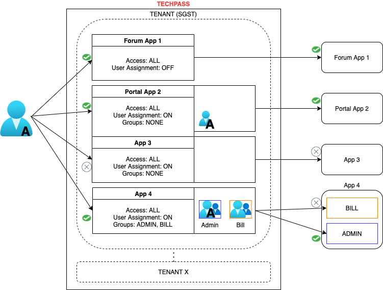
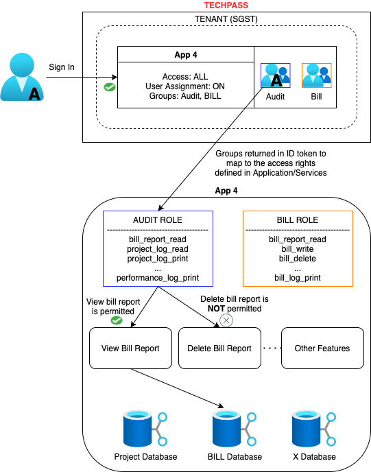

# Role-based access control (RBAC)

In computer systems security, role-based access control or role-based security is an approach to restricting system access to authorized users.
**RBAC** lets employees (**the who?**) have access rights only to the resources (**the what?**) they need to do their jobs and prevents them from accessing resources that doesn't pertain to them.

## RBAC service in TechPass (Shared Model)
TechPass **DOES NOT** provide a full-fledged RBAC service at the moment. 

Managing RBAC is a **shared model of responsibility** between products/services and TechPass.
TechPass will provide the features to control the **Who** that can access your resources.
It is then up to individual product and services to manage the **What** these users can access.

To design a proper access control model, tenants need to answer two questions:

- **Who** has access to our application/service?
- **What** actions can they perform on our application/service?

## The Who?
Managed using TechPass.

There are 2 types of Coarse Grain access controls that you can setup to allow users access to your application/services.
- individual users
- groups

These are achieved using [User Assignment](applications#user-assignment-required) feature 

### User Assignment
In TechPass, Tenants can configure their applications to only allow authorised users to sign in. 
This is done by ensuring the [*User Assignment Required*](applications#user-assignment-required) setting is checked. 
With this setting enabled, any user who wishes to sign in to your application will need to be assigned access to the app. This allows the tenant to perform pre-approval checks on the user before access is granted. 
This is useful for application that are/should be accessible only to a specific subset of TechPass users. 

?> Assigning access to users can be programmatically given via TechPass's [*Automation APIs*](apis/integration). The APIs provide tenants with the versatility to implement automated pre-approval checks in their backend and then call the relevant API to assign access once the checks are completed.

For example, your service is a paid subscription model. You will allow only paid users to access.
You can enable *User Assignment Required* and add the paid users to your application.

Alternatively, you can uncheck the setting to allow ANY user with a TechPass account to sign in to your app. For example, a community forum for SGTS. Anybody is welcome to enter and participate as long as he is has a verified identity.

### Role Based Access Control Using Groups
Groups within TechPass serves as a dual-purpose feature. 
- **Logical**:  
  You can choose to use groups as a logical representation of your different users.
  Eg. group by agencies/teams. 
- **Security/Role**:   
  Or you can use groups to provide access controls to different resources within your service.   
  Eg. A billing group to access finance & billing service. Add project manager and finance executives to that group. 
  A admin group to access all features or audit group to access only the logs and reporting, etc
  
The tenant admins can carry out their own verification of actual user identity before granting access.

Off-the-shelf proprietary applications should already come with some sort of access control mechanism built-in. Depending on the capability of the application, it may not be possible for tenants to manage permissions via TechPass. Tenants will need to manage access locally on these applications using the built-in feature.

Certain proprietary applications do support features that allow TechPass to manage permission through the use of groups. These applications can read the group property value from the *access token* and *id token* that is issued by TechPass and assign permission according to the group that the user is in. Tenants will need to consult the technical documentations to figure how to configure their applications to read this information.

?> To allow an application access to the group information of a user, tenants will need to create a group, assign the group to the application and then add the user into the group. This is to ensure relevant application privilege information for the user is returned via the tokens.

For applications that are developed from the ground up, careful consideration should be done to determine if the access control capabilities should be fully built into the application or make use of the token information that is returned by TechPass AAD. There's no correct way of doing it, but only the preferred way. 

!> There's a limit of 50 user groups for each namespace. Tenants will need to take this into consideration when deciding which method to adopt. 

Diagram illustrates the scope of TechPass RBAC feature

## The What?
Managed by applications/services

Once access to sign in is granted, the next question to consider would be what actions can the user perform in the application?
This fine grain access control, managed by you, should define attributes like resources/information users/groups/roles can access.

You can make use of groups that are returned within the ID tokens to map to the list of resources access rights within your system.

### Least Privilege
The general rule of thumb is to apply the least privilege when providing access to your resources for your users.
> Least privilege is the concept and practice of restricting access rights for users, accounts, and computing processes to only those resources absolutely required to perform routine, legitimate activities. 
Privilege itself refers to the authorization to bypass certain security restraints.
[Reference](https://www.beyondtrust.com/blog/entry/what-is-least-privilege#:~:text=Least%20privilege%20is%20the%20concept,to%20bypass%20certain%20security%20restraints.)

## External References
- [RBAC](https://en.wikipedia.org/wiki/Role-based_access_control)
- [Least Privilege](https://www.f5.com/labs/articles/education/what-is-the-principle-of-least-privilege-and-why-is-it-important)
- [Azure AD Documentation](https://docs.microsoft.com/en-us/azure/active-directory/)
- [IETF OAuth 2.0 Spec](https://tools.ietf.org/html/rfc6749)
- [OpenID Connect 1.0](https://openid.net/connect/)
- [SAML 2.0](http://docs.oasis-open.org/security/saml/Post2.0/sstc-saml-tech-overview-2.0.html)
