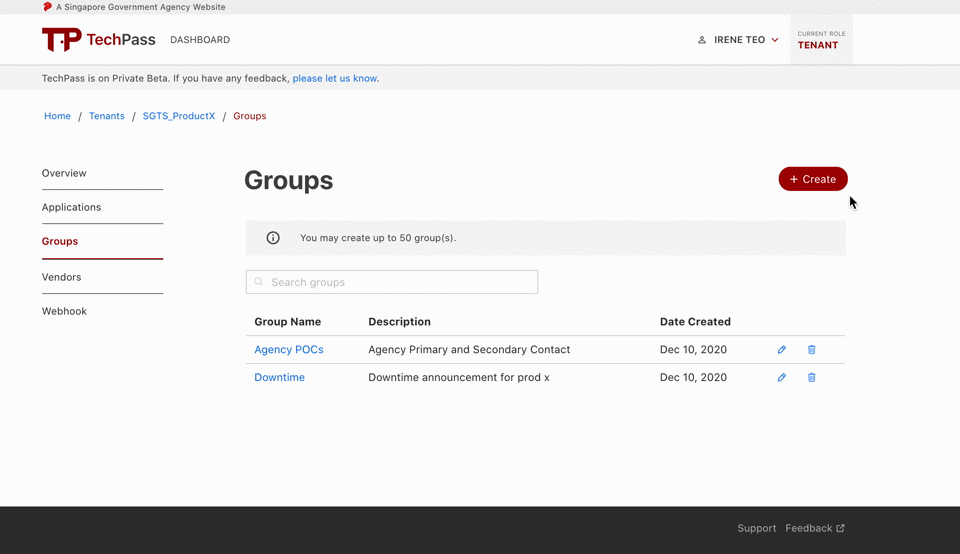

# User Groups
## Overview
The Group is collection of users. Groups allow you to specify permissions for multiple users, which can make it easier to manage the permissions for those users.

Any users assigned in a specific group automatically has the permissions that are assigned  to the group.

A group can contain many users, and a user can belong to multiple groups.

## Creating a User Group
1. To create user group, click on **Create**.
2. Click on **Add users or groups** and a popup will appear.
 
  ?>You can even add existing groups into new groups! 

 