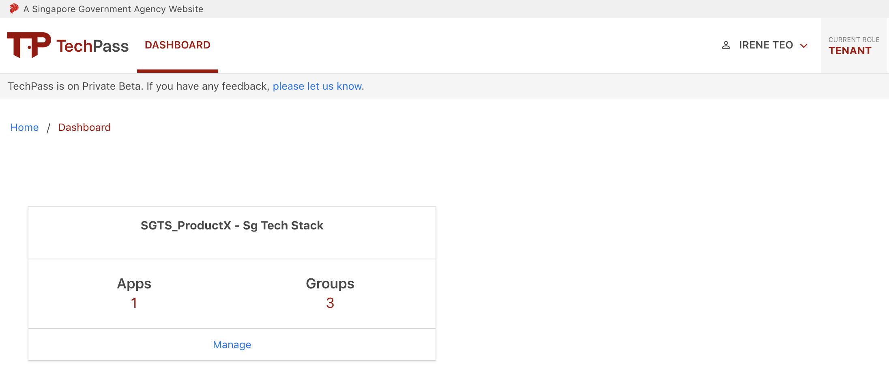
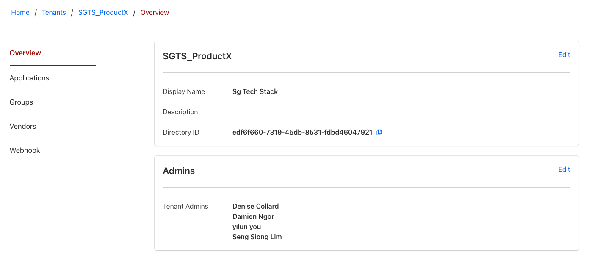
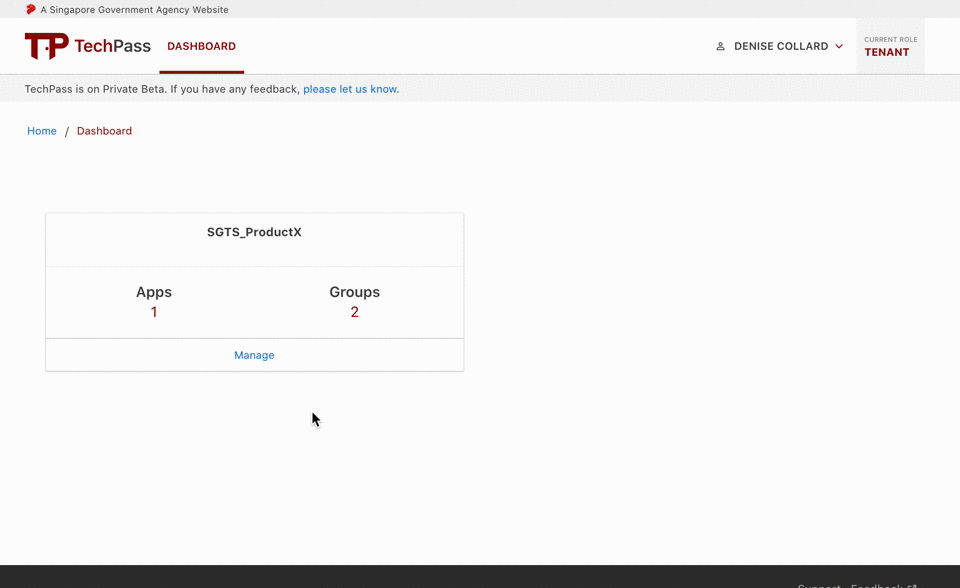
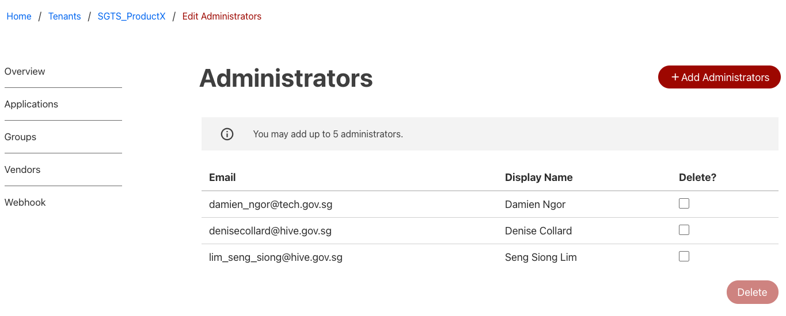
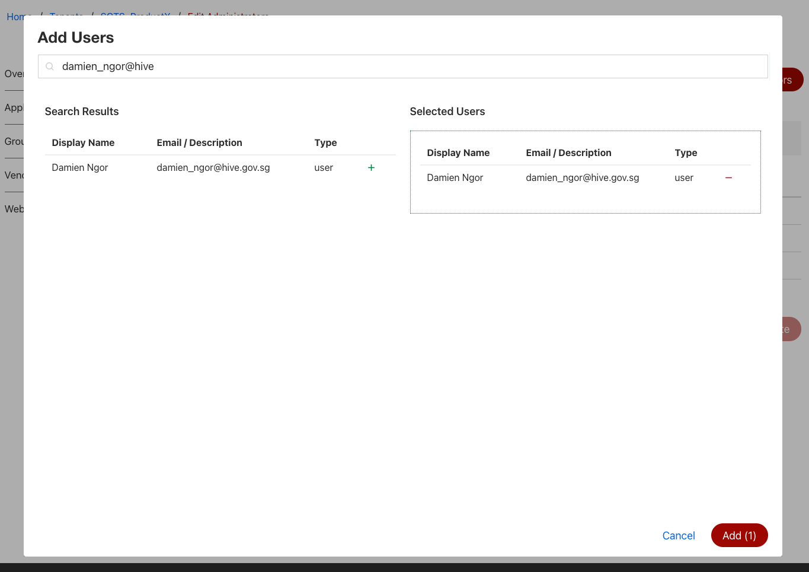
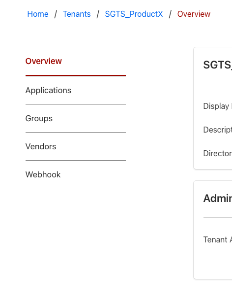

# Tenant Namespace
## Overview
Each service that has onboarded to TechPass are called tenants. Tenants get access to features that allow them to configure and consume TechPass services. Each tenant is given a namespace on TechPass. A Namespaces is an isolated environment within TechPass that safeguards your resources/objects from other tenants. 

Only authorized Tenant Administrators get access to a specific project's namespace and other tenant administrators cannot gain access to your namespace unless authorized by you or your co-admins.

As Tenant Admin, you will see a list of Tenant Namespaces that you have been authorized to access on your dashboard.

To get an overview about a namespace, click on ***Manage***. 

You will see the Display Name, Description of the namespace and a directory ID. We will touch on directory ID in later sections. You will also see a list of current Tenant Administrators authorised to manage this namespace. 

You can update a namespace's *Display Name* and *Description* here. These information will be useful to help other TechPass users know what your product is about.

## Managing Tenant Admins
Besides updating your namespace's info, you can also manage the user(s) that are authorised to manage the current namespace. To update the list of admins, click on the ***Edit*** button in the *Admins* section.

### Adding new Admins
1. Click on ***Add Administrators*** and a popup will appear.

   

2. Type in a search phrase to find the administrator you want to add.
3. Click on the '+' button next to the user in *Search Results*. It should appear on the *Selected Users* list.
   
   ?> You can remove a selected user by clicking on the '-' button next to the user in the *Selected Users* list.

4. Click on ***Add*** at the bottom of the popup dialog to add your selected users.

### Removing Existing Admins
1. Tick the checkbox(es) next to the user(s) that you want to delete.
2. Click on ***Delete***.
3. Click on ***Confirm*** in the popup dialog.

## Namespace Objects
As a tenant of TechPass, you are granted access to our many features. You can use these features to create objects to help you:
- integrate your services with TechPass AAD. ([Applications](applications))
- manage your user access and permissions. ([Applications](applications) and [Groups](groups))
- onboard users onto your services. ([Vendors](vendors) and [APIs](apis))
- get notified of system events. ([Webhooks](webhooks))

The objects are organized into separate tabs on the left in the *Namespace Overview* screen. As we continue development of TechPass, more features will be made available for you. So keep a look out for new feature releases!

*Proceed to the subsequent sections to find out how you can carry out these actions on the TechPass portal.*