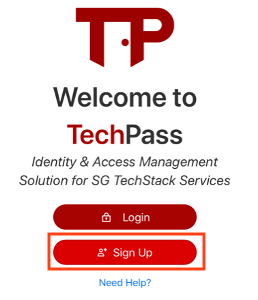
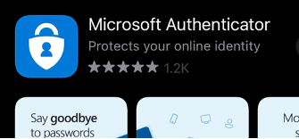

# Getting Started

## Logging In

If you already have a TechPass account, you can use TechPass to sign-in to any of the integrated services on SG TechStack. Simple look for the "***Sign-In with TechPass***" button on the services' sign-in page.

If you have do not have a TechPass account yet, follow the instructions below to sign up for one.

## Signing up for a TechPass Account

### Users with valid gov.sg email
If you are a user with a **valid gov.sg email account** and have set up your cloud account, you can start by signing up you TechPass account with your gov.sg email on TechPass portal using your **GSIB device**. An email will be sent to your gov.sg mailbox with instructions on how to setup your account.

If you have yet to set up your WoG cloud account, please see [here]().

To setup your TechPass Account:

1. Visit our TechPass portal home page and click ***Sign Up***.
   
   

2. Key in your valid gov.sg email. An *invitation email* will be sent for your acceptance.
3. Click the link on the email to start the sign up process.
4. Key in your verification code that you have setup with your WoG cloud account. If you have yet to set up your WoG cloud account, click [here]() to set up.
5. Read and click ***Accept*** to the *Review Permissions* Terms and Conditions.
6. You will then be required to setup your 2FA using *Microsoft Authenticator* on your mobile. Follow the instructions on the screen to complete your first time setup.
   
   

7. Once your authenticator is configured successfully, you should get a notification on your mobile phone whenever 2FA is required. Click ***Approve*** to verify your sign in.

   

### Verified Vendors/Contractors working on Gov ICT Projects

You will need to inform your project manager or manager-in-charge. They will work with the corresponding SG TechStack service teams to setup a TechPass account for you.

!> Ensure that you do not have an existing and valid gov.sg email before requesting for a TechPass Account.

### Setting up your WoG Cloud Account
1. Click [here]() for the link to setup your WoG Cloud Account.
2. Click ***+ Add Method*** and add ***Authenticator App*** from the drop-down bar.
3. On your mobile device, search and download Microsoft Authenticator from your Google Play Store / App Store.
   
   

4. On your authenticator app, click on ***Add an Account***, and select ***Work or School***.
   Scan the QR code to setup the account on your authenticator. Once scanned, click ***Next*** and set up is done.
   
   
