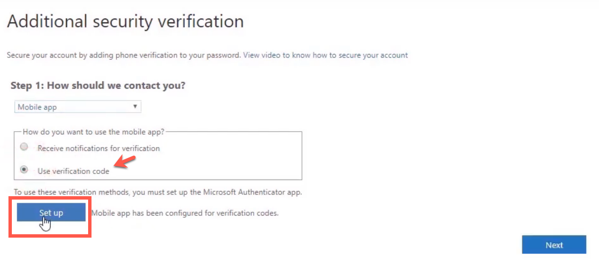
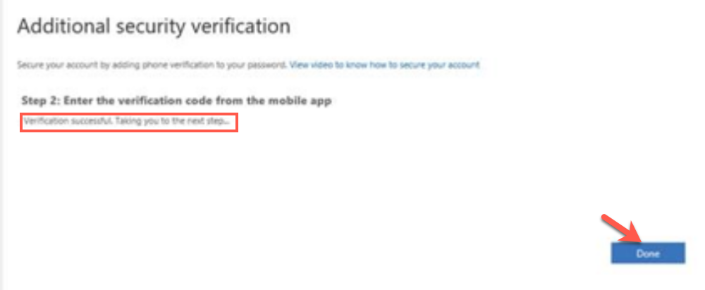

# Setup two-factor authentication for Microsoft 365 account

This section guides public officers to setup two-factor authentication(2FA) for their Microsoft 365 account.

_To setup 2FA for your Microsoft 365 account:_

1. From your GSIB machine, go to [https://account.activedirectory.windowsazure.com/proofup.aspx](https://account.activedirectory.windowsazure.com/proofup.aspx)
2. Sign in with your corporate email address and click **Next**.

?> If you are public officer whose corporate email ID has been changed, use the new email ID.

3. If you are an existing user, you will be prompted to approve your sign in from your mobile phone. Tap **Approve** or enter the six-digit code displayed on your authenticator app.
4. The **Additional Security Verification** page is displayed. Specify **Mobile app** as the preferred authenticating method, then choose **Use verification code** and click **Set up**.

You will now be taken to the **Configure mobile app** page.

5. If you do not have Microsoft Authenticator app on your mobile phone, download and install it on your [Microsoft phone](https://www.microsoft.com/en-sg/store/apps/windows-phone), [Android](https://play.google.com/store/apps?hl=en&amp;gl=US) or [iOS](https://www.apple.com/app-store/)phone or go to step 6.
6. If you already have Microsoft Authenticator app on your mobile phone, ensure that **Enable Phone Sign in** is turned off.
7. Follow the instructions on the **Configure mobile app** page.
8. In the **Additional Security Verification** page, a confirmation message _Mobile app has been configured for notification and verification codes_ is displayed. Click **Next**.

9. Enter the six-digit verification code on your computer and click **Verify**.

10. You will see a confirmation message _Verification successful. Taking you to the next steps._ Click **Done**.

If you have already setup <>

_To set up 2FA for your corporate email address:_

1. From your GSIB machine, go to [https://account.activedirectory.windowsazure.com/proofup.aspx](https://account.activedirectory.windowsazure.com/proofup.aspx)to access **Additional security verification** page.
2. If you are prompted to sign in, enter or choose your corporate email address.
3. When prompted to approve your sign-in, based on your setup, tap **Approve** on the authenticating mobile app or by using the six-digit OTP displayed on the authenticating mobile app.
4. Click **Set up Authenticator app**.

5. QR code will be displayed.
6. If you do not have Microsoft Authenticator app on your mobile phone, download and install it on your [Microsoft phone](https://www.microsoft.com/en-sg/store/apps/windows-phone), [Android](https://play.google.com/store/apps?hl=en&amp;gl=US) or [iOS](https://www.apple.com/app-store/)phone or go to step 7.

7. If you already have Microsoft Authenticator app on your mobile phone, ensure that **Enable Phone Sign in** is turned off.
8. Follow the instructions on the **Configure mobile app** page.

9. In the **Additional Security Verification** page, a confirmation message _Mobile app has been configured for notification and verification codes_ is displayed. Click **Next**.

10. You will be prompted again to approve the sign-in by tapping approve or by entering the six-digit OTP.

11. You will see a confirmation message _Verification successful. Taking you to the next steps._ Click **Done**.

