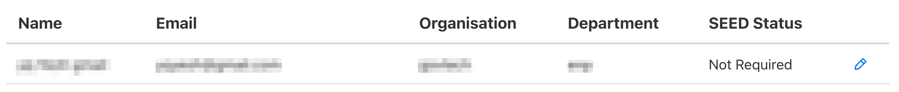
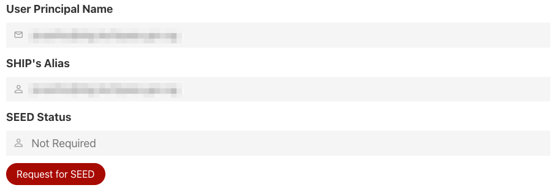

# Vendors
## Overview
Tenant admins are able to invite vendors as Tenant co-admins, or as application users to your services. Localised identities can be created for them through the TechPass portal.

?> A vendor is a non-Government developer that is collaborating on a Government project or using a Tenant service

## Provisioning Vendor Accounts
 1. To provision vendor accounts, click **Invite Vendor**

 2. Fill in the required information and click **Submit**

!> Note: Email, username and mobile number must be unique.

Please inform your vendor to use his account if it is an existing user account.
Contact TechPass if the account is disabled due to inactivity.

?> The invited vendor would receive an email indicating the **username** and a phone SMS for the **password**

You can then proceed to add the vendor as a [co-admin](namespaces#Managing-Tenant-Admins) or add as an [application user](applications#Managing-Access-to-your-App)!

?> To edit your vendor info, simply click on the edit icon beside your vendor row!

## Request for SEED on behalf of vendor
1. There are 3 possible SEED status:
   - <strong>Not Required</strong> - user has not been assigned SEED licenses
   - <strong>License Assigned</strong> - user has been assigned SEED licenses but has yet to onboard their device to SEED
   - <strong>Fully Onboarded</strong> - user has been fully onboarded to SEED.     

2. User will need to have the necessary SEED licenses assigned to them before they can onboard their device to SEED.

3. To request for SEED licenses on behalf of vendor, click on the edit icon beside the vendor row.

4. Click on 'Request for SEED' (button will be displayed if SEED Status is 'Not Required'). This will assign user with the necessary SEED licenses and send a SEED onboarding email to them. User will need to follow the instructions in the email to onboard their device to SEED.
