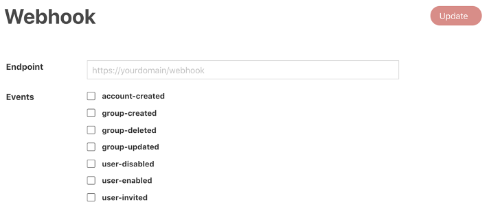

# Webhooks
## Overview
Webhooks are HTTP API endpoints that gets called whenever an event occurs on TechPass. The API endpoint must either be publicly routable or whitelisted to accept HTTPS network traffic from TechPass service.

## Configuring your Webhooks

### Setup your webhooks

1. Provide the exact HTTP URL to call.
2. Check the events that you would like to be notified for.
3. Click ***Update***.

### Removing Webhooks
Simply un-check the events that are check and click ***Update***.