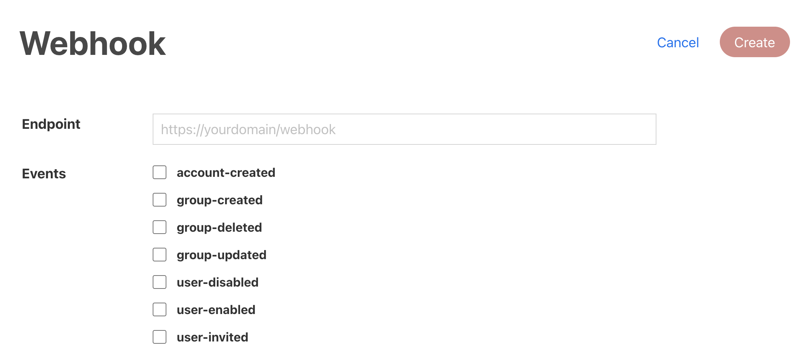

# Webhooks
## Overview
Webhooks are HTTP API endpoints that gets called whenever an event occurs on TechPass. The API endpoint must either be publicly routable or whitelisted to accept HTTPS network traffic from TechPass service.

You can get started with webhooks using the following steps:
1. [Create](#create) a webhook endpoint on your server.
2. [Register](#register) the endpoint in TechPass Integrations - Webhook.
3. Save the webhook secret and use it to [verify](#verify) TechPass issued HMAC signatures for every webhook event.

## Configuring your Webhooks <a id="create"></a>
### Verification and Registration
Webhooks will only be sent out to endpoints that have been verified and registered by TechPass backend. In order for TechPass backend to verify your webhook endpoint, you will first have to configure your webhook endpoint on your server.

### Verifying Webhook Endpoint
TechPass requires that the specified webhook endpoint belongs to you before it can register and save the endpoint to your tenant namespace.

To do this, when you create or update your webhook endpoint, TechPass backend will generate a random string as a token, and fire a GET request to your endpoint with a query parameter `challengeToken` for a verification request.

```HTTP
GET https://example.com/webhook?challengeToken=YJ_kmLqUz5QkZ9xra4jcnzn3xwczvul_tdoDztSZicQ=
```

We expect your endpoint to return the token in a JSON response body in the `challengeToken` field.

```JSON
{
  "challengeToken": "YJ_kmLqUz5QkZ9xra4jcnzn3xwczvul_tdoDztSZicQ="
}
```

#### Example code setup

<!-- tabs:start -->

#### ** Node **

```javascript
const express = require('express');
const app = express();
const PORT = process.env.PORT || 4321;

app.use(express.json({ limit: '10kb' }));

app.get('/webhook', (req, res) => {
  challengeResponse = req.query.challengeToken;

  res.setHeader('X-Content-Type-Options', 'nosniff');
  res.status(200).send({ 'challengeToken': challengeResponse });
});

app.listen(PORT, () => {
  console.log(`Express server started on port ${PORT}`)
});
```

<!-- tabs:end -->

### Registering your webhook <a id="register"></a>
Once you have your webhook endpoint configured on your server, you can register the endpoint in TechPass. From the Integrations page, under Webhook, click on Create.



1. Provide the exact HTTP URL to call.
2. Check the events that you would like to be notified for.
3. Click ***Create***.

You will receive a webhook secret upon a successful registration.

## Check Signatures <a id="verify"></a>
To enhance the security of webhooks, TechPass backend will perform signed requests to all webhook requests sent to our Tenant(s). Each webhook request will contain a `X-TECHPASS-SIGNATURE` header which contains a timestamp and a signature hash which is generated using HMAC-SHA256 with your unique webhook secret.

To prevent replay attacks by malicious actors, check that the difference between the timestamp you received the webhook request and the timestamp attached in the `X-TECHPASS-SIGNATURE` header does not exceed 5 minutes.

To prevent data tampering attacks, compute a HMAC-SHA256 signature hash and compare if the computed signature matches the signature attached in the `X-TECHPASS-SIGNATURE` header. Refer to the instructions in the below section to understand how the HMAC-SHA256 signature hash can be computed.

### Validating Signatures

You can compute and validate the signature using the following steps:

1. Save the current timestamp of the received request and the webhook secret to a variable
2. From the `X-TECHPASS-SIGNATURE` header, extract the timestamp and signatures
3. Save the raw JSON payload to a variable
4. Prepare the signature payload by concatenating the timestamp and JSON payload together, using a colon(:) as a delimiter.
5. Compute a SHA256 HMAC of the signature payload by using your webhook secret as the key.
6. Compute the hex digest of the HMAC.
7. Compare your computed signature against the signature extracted from `X-TECHPASS-SIGNATURE`.

If the difference between the time when the webhook request is received and the timestamp in the signature is more than 5 minutes, you may treat it as a replay attack and ignore the request.

If the computed signature and the signature extracted from the header do not match, the request should not be processed.

#### Example code setup

<!-- tabs:start -->

#### ** Node **

```javascript
const express = require('express');
const crypto = require('crypto')
const dotenv = require('dotenv');
dotenv.config();

const app = express();
const PORT = process.env.PORT || 4321;

app.use(express.json({ limit: '10kb' }));

app.post('/webhook', async (req, res) => {
  // 1. Save the current timestamp of the received request to a variable
  const timeReceived = Math.floor(new Date().getTime() / 1000)
  const secret = process.env.WEBHOOK_SECRET;

  // 2. From the X-TECHPASS-SIGNATURE header, extract the timestamp and signatures
  const signature = req.headers['x-techpass-signature'];
  const [timekv, signedKv] = signature.split(',')
  const [, timeSent] = timekv.split('=')
  const [, signedHash] = signedKv.split('=')

  // If more than 5 mins, treat it as a replay attack and ignore request
  if (timeReceived - timeSent > (60*5)) {
    return res.status(200).send()
  }

  // 3. Save the raw JSON payload to a variable
  const reqPayload = JSON.stringify(req.body);
  // 4. Prepare the signature payload by concatenating the timestamp and JSON payload together, using a colon(:) as a delimiter.
  const signedPayload = `${timeSent}:${reqPayload}`
  // 5. Compute a SHA256 HMAC of the signature payload by using your webhook secret as the key.
  // 6. Compute the hex digest of the HMAC.
  const computed = crypto.createHmac("sha256", secret).update(signedPayload).digest('hex');
  // 7. Compare your computed signature against the signature extracted from
  const valid = signedHash === computed

  if (valid) {
    // do whatever automation when webhook triggered
    res.status(200).send({
      msg: 'webhook received successfully',
      data: req.body
    })
  } else {
    // return 200 just to reply to webhook
    res.status(200).send()
  }
});

app.listen(PORT, () => {
  console.log(`Express server started on port ${PORT}`)
});
```

<!-- tabs:end -->

## Removing Webhook
Simply clear the webhook endpoint and un-check the events that are checked and click ***Update***.
